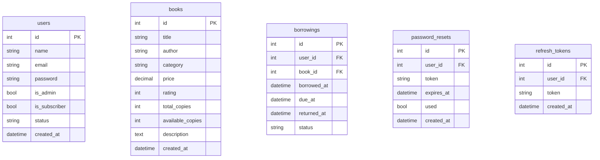

<div style="background:#ffebeb;padding:16px;border-radius:12px;text-align:center;font-size:24px;font-weight:700;">📚✨ Static Public Pages</div>

These HTML files form the **public-facing pages** of the digital library. They include navigation, styling, and references to shared assets.

---

## 🌐 `static/index.html` — Landing Page


This is the **landing page**.

* 🧭 Responsive navbar (Home, About, Pricing, Contact, User Dashboard)
* 🎨 Loads Bootstrap, Google Fonts, Font Awesome
* 🎞️ Hero section, features, footer
* ⚙️ Scripts: `animations.js`, `simple-books.js`

```html
<!DOCTYPE html>
<html lang="en">
<head>
  <meta charset="UTF-8">
  <title>Digital Library – Home</title>
  <link rel="stylesheet" href="/static/css/main.css">
</head>
<body>
  <nav>…</nav>
  <section class="hero">…</section>
  <footer>…</footer>
  <script src="/static/js/animations.js"></script>
  <script src="/static/js/simple-books.js"></script>
</body>
</html>
```

---

## 🧑‍🚀 `static/about.html`

* 🚀 Particle animations (`particles.js`)
* 🪪 Team & mission section
* 🟦 Uses `about.css` & `about.js`

---

## 💰 `static/pricing.html`

* 📦 Subscription tiers: **Free** & **Premium**
* 🔄 Billing cycle toggle
* 🔗 Redirects via `dashboard.js`

---

## ✉️ `static/contact.html`

* 📮 Contact form: Name, Email, Message
* ✔️ Validation via `contact.js`
* 📤 Submits to `/api/contact`

---

<div style="background:#e6f7ff;padding:16px;border-radius:12px;text-align:center;font-size:24px;font-weight:700;">🔐 Public Authentication Pages</div>

## 🔒 `static/auth/login.html`

* 📧 Email + Password login
* 🔗 Register / Forgot Password links
* ⚙️ Uses `auth.js` → `/api/auth/login`

## 🆕 `static/auth/register.html`

* 📝 Name, Email, Password
* 💪 Password strength meter
* 📤 Sends data via `auth.js`

## 🔑 `static/auth/user-forgot-password.html`

* 2-step reset: **Email → Token + New Password**
* 🔄 Controlled by `user-forgot-password.js`

---

<div style="background:#fff8e6;padding:16px;border-radius:12px;text-align:center;font-size:24px;font-weight:700;">⚙️ JavaScript Modules</div>

## 🎞️ `animations.js`

* Scroll animations
* Parallax & particle effects

## 📊 `about.js`

* Loads stats → displays counters/cards

## ✉️ `contact.js`

* Form validation
* POST to `/api/contact`

## 🔐 `auth.js`

* Login/Register utility
* Token storage, redirects

## 🔑 `user-forgot-password.js`

* Multi-step password recovery handler

## 🧑‍💼 `user-profile.js`

* Fetch/update user details

## 📈 `user-dashboard.js`

* Borrowing stats → charts/tables

## 🧭 `dashboard.js`

* Tab logic, theme switch, charts

## 📚 `simple-books.js`

* Fetch & render book list

## 📘 `book_management.js`

* Admin CRUD for books

## 👥 `user_management.js`

* Admin user table (search, pagination)

## 🛠️ `admin-utils.js`

* Shared admin API & notifications

## 🛂 `admin-login.js`

* Admin login handler

## 🆔 `admin-signup.js`

* Admin registration

## 🔏 `admin-forgot-password.js`

* Admin password reset

## 📊 `admin-dashboard.js`

* Loads system-wide stats

## 🧾 `admin-users.js`

* Ban/unban, user edits

## ⚠️ `error-pages.js`

* Custom 404/500 routing

---

<div style="background:#f0eaff;padding:16px;border-radius:12px;text-align:center;font-size:24px;font-weight:700;">🖋️ Server-Side Templates (Jinja2)</div>

## 🛑 `templates/Error/*.html`

* Friendly messages for HTTP errors

## 📊 `templates/dashboard.html`

* User dashboard shell

## 👤 `templates/users/profile.html`

* Profile editing page

## 📚 `templates/library/books.html`

* Filterable book list

## 🛠️ Admin templates

* Login, signup, forgot password
* Dashboard, book management, user management

---

<div style="background:#eaffe6;padding:16px;border-radius:12px;text-align:center;font-size:24px;font-weight:700;">🐍 Backend Application</div>

## `app.py`

* Flask app setup
* JWT auth
* API routes for users, books, admin, borrowings
* Error handlers

```python
@app.route('/api/auth/login', methods=['POST'])
def login():
    return jsonify({'status':'success','data':{'access_token':access,'refresh_token':refresh}})
```

## 🗄️ `db.py`

* MySQL pooling
* Auto-create DB
* `get_db()` helper

---

<div style="background:#ffe6fb;padding:16px;border-radius:12px;text-align:center;font-size:24px;font-weight:700;">🗃️ Database Schema</div>



---

<div style="background:#e6f0ff;padding:16px;border-radius:12px;text-align:center;font-size:24px;font-weight:700;">🧰 Tech Stack</div>

### **Tech Stack Logos**


## Backend 🐍

* Python 3
* Flask 2
* Jinja2
* PyJWT
* passlib
* python-dotenv

## Database 🗄️

* MySQL / MariaDB
* mysql-connector-python

## Frontend 🎨

* HTML5, CSS3, JS (ES6+)
* Bootstrap 5
* Font Awesome 6
* Custom JS modules

## Tools 🛠️

* Mermaid diagrams
* venv
* Flask dev server
